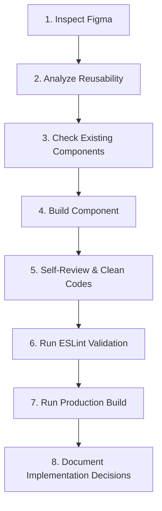

# AI Development Operating Manual

## Purpose

This document defines the strict, non-negotiable standards, workflows, and behavioral rules that all AI agents must follow when contributing to the Chalachal Technical Services LLC React frontend repository. 

All future AI agents working on this codebase must treat this document as their permanent operating manual. The primary objective is to maintain:
- **Production-grade React code** that is clean, readable, type-safe, and self-documenting.
- **Maximum reusability** by creating parametric, highly decoupled visual containers and controls.
- **Clean architecture** through strict separation of concerns (atomic UI vs. composite features vs. page assemblers).
- **Zero unnecessary duplication** of styling, layout configurations, or functional scripts.
- **Strict adherence to the Figma design** down to colors, dimensions, borders, and animations.

---

## Before Every Task

Before proposing, drafting, or writing any code, the AI must always perform these mandatory steps:

1.  **Read and internalize:**
    - [docs/01-project-rules.md](file:///d:/Dubai_project/docs/01-project-rules.md) (The master coding and repository guidelines)
    - [docs/Dubai-Dev_Figma_Analysis_Report.md](file:///d:/Dubai_project/docs/Dubai-Dev_Figma_Analysis_Report.md) (The structural report of layout properties and section specs)
2.  **Inspect the Figma design:**
    - Always use the configured Figma Model Context Protocol (MCP) server to check coordinates, spacings, typography weights, line heights, and colors.
    - **Never guess UI.**
    - **Never invent spacing.**
    - **Never invent typography.**
    - **Never invent layouts.**

---

## Missing Figma Behaviour

If a behaviour or layout is not represented in the Figma design:
- **Do not invent it.**
- **Document the assumption** or fallback chosen.
- **Request clarification** from the user if necessary before proceeding with high-impact layouts.

---

## Component Creation Workflow

Every component introduced to the repository must follow this lifecycle exactly:



1.  **Inspect Figma:** Fetch the design node metadata, variable definitions, and screenshot files.
2.  **Analyze Reusability:** Assess if the layout should be generalized or decoupled from business data.
3.  **Check Existing Components:** Look under `src/components/ui/` or `src/components/features/` to verify that the functionality doesn't already exist.
4.  **Build:** Create the co-located files using design token variables and strict React patterns.
5.  **Self-Review:** Scan for inline styles, console statements, hardcoded strings, or direct tag-styling.
6.  **Run ESLint:** Execute `npm run lint` and resolve all style and syntax violations.
7.  **Run Production Build:** Execute `npm run build` to confirm Vite compilation completes successfully.
8.  **Document:** Write JSDoc comments, prop validations, and markdown usage guides.

---

## Component Folder Structure

Every reusable component must be isolated in its own folder under `src/components/ui/` (atomic, project-agnostic components) or `src/components/features/` (domain-specific interactive blocks):

```text
Component/
├── Component.jsx          # Core JSX code (React.memo, JSDoc, PropTypes)
├── Component.module.css   # Scoped Vanilla CSS module using design tokens
├── constants.js          # Preset options, layouts, alignments, styles
├── README.md             # Prop specifications, APIs, usage examples
└── index.js              # Default entry point exporting the component
```

### Optional Files
Depending on complexity, components may also include:
- `hooks.js` (Component-specific custom hooks)
- `types.js` (Type definitions or shared type objects)
- `__tests__/` (Unit testing specs)

---

## Mandatory Rules

Every component file must answer **YES** to all these rules:

*   ✔ **React.memo:** Every UI component must be wrapped in `memo` from `'react'` to prevent redundant virtual DOM calculations.
*   ✔ **PropTypes:** All props must be explicitly declared and validated using `prop-types` rules.
*   ✔ **JSDoc:** Every component and complex function must be documented with clean JSDoc syntax explaining arguments and returns.
*   ✔ **CSS Modules:** Styles must be written in a co-located, matching `PascalCase.module.css` file using `camelCase` class names.
*   ✔ **README.md:** Provide API descriptions, examples, and responsive guides.
*   ✔ **constants.js:** Relocate styling variations, preset limits, and options out of the logic file.
*   ✔ **index.js:** Expose clean default exports (`export { default } from './Component'`).
*   ✔ **Responsive:** Ensure visual components scale gracefully from mobile (`412px`) to desktop (`1920px`) using media queries.
*   ✔ **Accessible:** Follow semantic tags, keyboard operability (Tab index, Enter/Space events), and ARIA specifications.
*   ✔ **Design Tokens:** Strictly reference CSS properties defined in `src/styles/tokens/`.
*   ✔ **Semantic HTML:** Use native elements (`<button>`, `<a>`, `<article>`) rather than binding actions to generic tags (`<div>`, `<span>`).

---

## Never Do These

*   ❌ **Never hardcode colors:** Do not use hex/rgba strings (`#035a2d`, `#ffffff`) in style sheets. Reference color tokens.
*   ❌ **Never hardcode spacing:** Do not write pixel-level layouts (`margin: 20px`). Reference spacing tokens.
*   ❌ **Never hardcode typography:** Avoid manual font size declarations (`font-size: 24px`). Reference typography tokens.
*   ❌ **Never duplicate JSX:** Do not copy-paste code lines; map arrays of constants.
*   ❌ **Never duplicate CSS:** Rely on CSS classes and global selectors inside `src/styles/global.css`.
*   ❌ **Never create page-specific reusable components:** Centralize components in shared UI/features directories.
*   ❌ **Never modify unrelated files:** Stay focused on files required for your designated task. Do not engage in unsolicited refactoring.
*   ❌ **Never ignore project rules:** Always obey `docs/01-project-rules.md` as absolute law.
*   ❌ **Never invent missing Figma designs:** Check with the user or clone layouts of verified responsive templates.
*   ❌ **Never skip lint/build verification:** Every edit must build cleanly before considering the task complete.

---

## Raster Asset Policy

The configured Figma MCP server cannot export original raster assets.

Never generate replacement images.

Never create placeholder branding.

Never fabricate photographs or illustrations.

If an original raster asset is required:

1. Verify whether it already exists in the repository.
2. If not, report the missing asset.
3. Continue implementing the layout using the expected asset path.
4. Wait for the designer's exported asset package before final image integration.

This prevents the AI from ever generating fake assets again.

---

## Design System Rules

*   **Atomic Foundation First:** Always inspect, use, and compose the core design system components before implementing custom markups:
    - `<Typography>` (Visual fonts and paragraph sizes)
    - `<Container>` (Figma grid desktop/mobile boundaries)
    - `<Button>` (Pill, solid, and text variants)
    - `<Icon>` (Lucide and custom optimized brand vectors)
    - `<Card>` (Shadow, corner radius, borders, and hover elevations)
*   **No Duplication:** Never recreate styling or structural logic that is already provided by these core components.

---

## Feature Component Rules

*   Feature components under `src/components/features/` represent domain blocks (e.g. `StatCard`, `ServiceCard`).
*   They may compose `<Typography>`, `<Button>`, `<Icon>`, `<Card>`, and `<Container>` components but must not recreate their functionality or duplicate styling tokens.
*   Keep feature components decoupled from routing or network contexts, allowing them to remain purely driven by props.

---

## Layout Rules

*   Layout components (under `src/components/layout/` or wrappers like `MainLayout`, `Navbar`, `Footer`, `MobileMenu`) are orchestrators.
*   They must reuse design system tokens and atomic components for layout elements, focus rings, link tags, and buttons.
*   Do not bundle styling declarations that belong to inner components inside the layout wrappers.

---

## Page Rules

*   Pages under `src/pages/` must act solely as page-level assemblers.
*   They must import layout components, features, and sections, mapping static lists to section wrappers.
*   **Pages must contain almost no styling.** Grid systems, custom paddings, margins, or colors must be deferred to the section and feature components.

---

## Routing Rules

- Keep all routes centralized in `src/routes/`.
- Never hardcode route strings inside components.
- Import route constants from `routes/paths.js` (or paths configurations).
- Prefer React Router navigation components (`<Link>`, `<NavLink>`) over manual `window.location` usage.

---

## Data Rules

- Static repeated content (such as navigation links, service cards, testimonials, FAQ data) must live inside `src/constants/`.
- Components should render collections dynamically using `.map()`.
- Never hardcode repeated business content inside JSX markup.
- Separate presentation concerns from data definitions.

---

## Styling Rules

*   **Vanilla CSS Modules Only:** Arbitrary style overrides, Tailwind class imports, or utility CSS libraries are banned.
*   **Design Tokens Only:** Style sheets must reference properties in `src/styles/tokens/` via `var()` exclusively.
*   **No Inline Styles:** Writing `style={{ ... }}` is strictly prohibited.
*   **No `!important`:** Do not use `!important` to force overrides; construct cleaner CSS selectors.
*   **Composition:** Combine styles dynamically using template strings or class join utilities:
    ```javascript
    const combinedClass = `${styles.base} ${styles[variant]} ${className}`.trim();
    ```

---

## Animation Rules

Animations and transitions must:
- Use transition design tokens exclusively (e.g. `var(--transition-normal)`).
- Respect user browser settings by applying `prefers-reduced-motion` media queries.
- Never block or delay user interaction.
- Be under `300ms` in duration unless specifically specified by the Figma documentation.
- Never animate layout properties (like `height`, `width`, `top`, `left`) when hardware-accelerated CSS properties (`transform`, `opacity`) can achieve the same visual outcome.

---

## Accessibility Checklist

- [ ] **Keyboard Navigation:** Every active item can be focused via `Tab`. Actionable components handle `onKeyDown` triggers (`Enter` and `Space` keys).
- [ ] **Focus Visible:** Elements display custom focus outlines (`:focus-visible`) when traversed via keyboard.
- [ ] **ARIA Labels:** Dynamic components and menus use proper labels (`aria-expanded`, `aria-label`, `aria-controls`).
- [ ] **Semantic HTML:** Correct tags (`<nav>`, `<main>`, `<section>`, `<button>`) are used.
- [ ] **Screen-Reader Support:** Decorative icons are hidden (`aria-hidden="true"`). Images have informative `alt` attributes.
- [ ] **Reduced Motion:** Check styles against `@media (prefers-reduced-motion: reduce)` to disable transitions for sensitive users.

---

## Performance Checklist

- [ ] **React.memo:** Ensure React components are memoized to eliminate cascading updates.
- [ ] **Avoid Unnecessary Renders:** Relocate calculations into `useMemo` and callbacks passed to child trees in `useCallback`.
- [ ] **Avoid Duplicated State:** Keep component states minimal and derived where possible.
- [ ] **Lazy Load:** Force lazy loading on below-the-fold media elements using `loading="lazy"`.
- [ ] **Keep Components Small:** Break down layout items if they exceed **150 lines** of code.

---

## Code Review

Before completing any task, ask:
- Can this component be reused elsewhere?
- Does a similar component already exist in the codebase?
- Can this component become simpler or more focused (SRP)?
- Does this implementation violate DRY (Don't Repeat Yourself) principles?
- Is this the smallest, most clean API (props list) possible?
- Would another developer understand this component in six months?

---

## AI Self Review

Before returning the final answer, the AI agent must verify:
- [ ] **No duplicated code:** Common patterns are helper functions, hooks, or shared components.
- [ ] **No hardcoded values:** Hex colors, margins, fonts, and borders use design tokens.
- [ ] **Uses design tokens:** References variables in `src/styles/tokens/` via `var()`.
- [ ] **Responsive:** Visually layout-safe on mobile, tablet, and desktop dimensions.
- [ ] **Accessible:** Semantic elements, key controls, keyboard-operable focus rings.
- [ ] **Reusable:** Modular component with parameter customization.
- [ ] **Production ready:** Complete cleanups, zero console debug logs, full error handle catch blocks.
- [ ] **Lint passes:** Clean ESLint checks with zero errors.
- [ ] **Build passes:** Successful production bundle compilation check.

---

## Verification Checklist

Before considering any task complete, the AI agent must run the following check:

- [ ] **`npm run lint`** completes successfully with no warnings or syntax errors.
- [ ] **`npm run build`** succeeds and packages the Vite production build.
- [ ] **Figma Comparison:** Ensure fonts, dimensions, layouts, and colors match Figma context screenshots.
- [ ] **Responsiveness:** Test UI on compact mobile (`412px`), tablet (`768px`), and desktop (`1920px`).
- [ ] **Accessibility:** Confirm keyboard navigation, focus overlays, and screen-reader readouts work properly.
- [ ] **Reusability:** Verify that the component accepts `className` and handles styling overrides dynamically.

---

## Required Deliverables

Every completed coding task must end with a comprehensive model response containing these sections:

1.  **Implementation Summary:** High-level narrative of what was created or modified.
2.  **Architecture Decisions:** Justification for structural, state, or wrapping layouts.
3.  **Accessibility Notes:** Details on tags, keyboard handlers, and ARIA attributes.
4.  **Responsive Behaviour:** Description of how the element adjusts across mobile and desktop breakpoints.
5.  **Build Verification:** Output of the Vite compilation check.
6.  **Lint Verification:** Confirmation of the ESLint validation run.
7.  **Remaining Considerations:** Open items, future performance enhancements, or user feedback needs.

---

## AI Behaviour

Future AI agents must behave as a **Senior Frontend Engineer**:
*   **Prioritize maintainability over speed.** Take the time to structure code cleanly and document it properly.
*   **Prioritize reusability over convenience.** Do not write quick inline hacks. Generalize structures using props.
*   **Avoid unnecessary abstractions.** Do not introduce custom context systems, global states, or helper functions unless they are requested or clearly warranted.
*   **Never over-engineer.** Solve the problem elegantly, maintaining simplicity while keeping code highly scalable.

---

## Git Rules

- Ensure there is exactly **one feature per commit**.
- Do not mix unrelated changes (e.g., refactoring standard utilities while building a feature page).
- All commit messages must follow the Angular semantic format:
  - `feat(<scope>): <subject>`
  - `fix(<scope>): <subject>`
  - `refactor(<scope>): <subject>`
  - `docs(<scope>): <subject>`
  - `style(<scope>): <subject>`
  - `chore(<scope>): <subject>`
